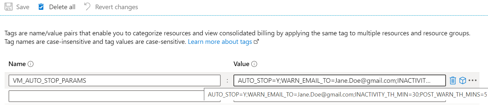

# VmAutoStop - an app for stopping inactive Azure Virtual Machines automatically

_Intended for optimizing compute costs of dev/test virtual machines. Not recommended for VMs running production or critical workloads._

The app automatically stops(deallocates) Azure Virtual Machines if they are inactive for a predefined period of time. Before stopping the VM, a warning email notification will be send. You have the flexibility to change:

1. Select VMs to be auto stopped by applying tags at resource group or individual VM level.
2. Duration of inactivity.
3. Email to which the notifications are to be sent.
4. Interval between sending notification email and stopping VM.
5. Parameter values which determines VM inactivity.

## How it works

An Azure Function app runs every minute and reads VM metric values - `Percentage CPU` and `Network Out` and calculates their standard deviation. If the standard deviation is less than the predefined threshold then VM is deemed inactive and a warning email is sent. Subsequently VM is stopped if it continues to be inactive.

**Assumption here is that variance/standard deviation of CPU utilization and Network traffic for an inactive VM is significantly lower than an active one. This is certainly true for VMs which has users logged in using SSH(Linux) or Remote Desktop(Windows) to performing dev/test activities**. App might not be suitable for machines which run more non-variable workloads.

Salient features:

- Developed using Azure Python Functions and Azure SDK for python.
- Resource tags are used for selecting or deselecting VMs to auto stop and providing runtime overrides for parameter values.
- Can be deployed to Azure Function Consumption plan or App Service Plan.
- Application state is stored using tags. No additional database/datastore requirement.
- Uses Managed Identity of the function app for accessing azure resources - subscriptions, resource groups, VMs and metrics.
- A custom role is used for providing just enough privileges to the app.

## Deploying to Azure

### Pre-requisites

- #### Azure CLI

  If you don't have Azure CLI, install it following instructions in here : https://docs.microsoft.com/en-us/cli/azure/install-azure-cli?view=azure-cli-latest.

- #### Azure Function tools

  Azure function tools is required for deploying the function app code. You will find the instructions for installing it here: https://docs.microsoft.com/en-us/azure/azure-functions/functions-run-local?tabs=windows#v2

- #### Azure SendGrid Account

  App uses SendGrid to send warning email before stopping VMs. Create an Azure SendGrid account following instructions in here : https://docs.microsoft.com/en-us/azure/sendgrid-dotnet-how-to-send-email#create-a-sendgrid-account. Note the SendGrid API key, you will need it while deploying the function app.

- #### This repo

  Clone this repo. You will find the ARM templates for deploying the function app and associated storage account, application insights etc. in the `Azure` folder. Move to it and execute the following commands for deploying the app.

### Deployment Instructions

1. Create custom role for the function app.

   ```sh
   az role definition create --role-definition ./vmautostop-custom-role.json
   ```

2. Create resource group for deploying the function app, storage account and application insights.

   ```sh
   az group create --name <Resource group name> --location <Location>
   ```

   example:

   ```sh
   az group create --name rg-vmautostop --location WestUS
   ```

3. Create the function app, storage account and application insights.

   ```sh
   az group deployment create --resource-group <Resource group name> \
      --template-file vmautostop-func-dedicated.json \
      --parameters '{ "sendGridApiKey": {"value": "<SendGrid api key>"},
                     "warningEmailFrom": {"value": "<From email id for sending warning email>"},
                     "warningEmailTo" :{"value": "<To email id for sending warning email>"}}'
   ```

   example:

   ```sh
   az group deployment create --resource-group rg-vmautostop \
      --template-file vmautostop-func-dedicated.json \
      --parameters '{ "sendGridApiKey": {"value": "SG.XXXXXXXXXXXXXXXXXXXXXXX"},
                     "warningEmailFrom": {"value": "vmautostop@gmail.com"},
                     "warningEmailTo" :{"value": "John.Doe@gmail.com"}}'
   ```

4. Get the service principle id of the function app.

   ```sh
   az functionapp show --name <Function app name> \
      --resource-group <Resource group name> \
      --query 'identity.principalId'
   ```

   example:

   ```sh
   az functionapp show --name fn-vmautostop-kjfmr2d6ddosw \
      --resource-group rg-vmautostop \
      --query 'identity.principalId'
   ```

5. Assign the custom role to the function app.

   ```sh
   az role assignment create --assignee <Service principle id> \
        --role "Virtual Machine Auto Stop" \
        --subscription <Subscription id>
   ```

   example:

   ```sh
   az role assignment create --assignee "ec359a23-0de2-47d6-a45d-67922448061a" \
     --role "Virtual Machine Auto Stop" \
     --subscription "3af84b10-189c-40a6-b66c-2905fcc0ea9d"
   ```

6. Build and publish the function app.

   ```sh
   func azure functionapp publish <Function app name> --build remote
   ```

   example:

   ```sh
   func azure functionapp publish fn-vmautostop-kjfmr2d6ddosw --build remote
   ```

### Selecting VMs to auto stop

VM(s) in a subscription can be selected for auto stopping by adding a resource tag(parameter tag) - `VM_AUTO_STOP_PARAMS` with value set to `AUTO_STOP=Y`. Also you can select all VMs in a resource group by adding the parameter tag to the resource group; in this case you can exclude a VM or set of VMs in the same resource group by setting their tag value to `AUTO_STOP=N`.

App adds another resource tag(timestamp tag) - `VM_AUTO_STOP_EMAIL_TIMESTAMP` to the VM at the time of sending notification email and sets its value to the current timestamp(UTC format). This is used by the app to keep track of the time elapsed after notification is sent. App will delete this tag before shutting down the VM or if it becomes active again.

### Setting parameter values

Behavior of the app is controlled by a set of parameters described in the below table. Default values for these parameters are set in the function app app settings at the time of deployment. At runtime, these values can be overridden for and individual VM or group of VMs(parameter tag at resource group level) by appending parameter values to the value of parameter tag - `VM_AUTO_STOP_PARAMS`, separated by semicolon`.

| Parameters - App Settings                | Parameters - Tag     | Description                                                                              |
| ---------------------------------------- | -------------------- | ---------------------------------------------------------------------------------------- |
| Not applicable                           | None                 | API Key for the Azure SendGrid account.                                                  |
| SENDGRID_API_KEY                         | Cannot be overridden | API Key for the Azure SendGrid account.                                                  |
| WARNING_EMAIL_FROM                       | WARN_EMAIL_FROM      | Email id `From` which notification is sent.                                              |
| WARNING_EMAIL_TO                         | WARN_EMAIL_TO        | Email id `To` which notification is sent.                                                |
| INACTIVITY_THRESHOLD_MINUTES             | INACTIVITY_TH_MIN    | Duration for which VM can remain inactive. Default is 60 minutes.                        |
| POST_WARNING_THRESHOLD_MINS              | POST_WARN_TH_MINS    | Interval between sending notification email and stopping VM. Default is 15 mins.         |
| PERCENTAGE_CPU_STDEV_BASELINE_PERCENTAGE | CPU_STDEV_BAS_PCT    | Baseline standard deviation for `Percent CPU` as percentage of mean. Default is 50%.     |
| NETWORK_OUT_STDEV_BASELINE_PERCENTAGE    | NETW_STDEV_BAS_PCT   | Baseline standard deviation for `Network Out CPU` as percentage of mean. Default is 50%. |

For example, following image shows how to override default values for parameters `WARNING_EMAIL_TO`, `INACTIVITY_THRESHOLD_MINUTES` are overridden `POST_WARNING_THRESHOLD_MINS` using the parameter tag.



Parameter values set at the VM level will override if(any) of the same parameter values set at the resource group level. This is useful if you want auto stop behavior to be different for some of the VMs in a resource group. For example, you want notification email to for a particular VM to be sent to a different email id than the one specified at the resource group level - therefore used by all VMs in the group or want to reduce the inactivity threshold etc.

## References

- [Azure functions python developer guide](https://docs.microsoft.com/en-us/azure/azure-functions/functions-reference-python)
- [Azure python SDK](https://docs.microsoft.com/en-us/azure/python/)
- [Managed identities for Azure resources](https://docs.microsoft.com/en-us/azure/active-directory/managed-identities-azure-resources/overview)
- [Custom roles for Azure resources](https://docs.microsoft.com/en-us/azure/role-based-access-control/custom-roles)
